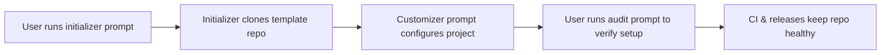
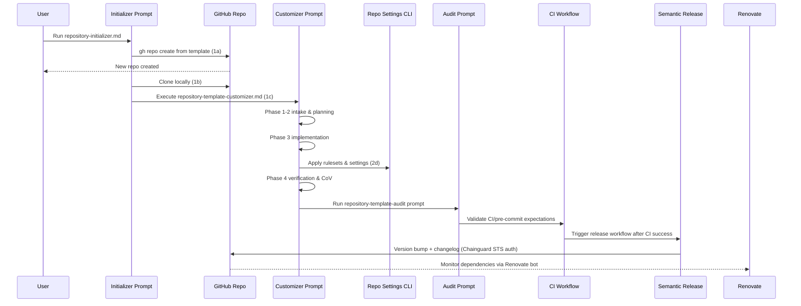

# Liatrio Open Source Template

A battle-tested GitHub template repository with opinionated developer experience, quality gates, and CI/CD automation ready for customization.

[](https://github.com/liatrio-labs/open-source-project-template/actions/workflows/ci.yml)
[](https://github.com/liatrio-labs/open-source-project-template/blob/main/LICENSE)

## Why Use This Template?

This template provides Liatrio teams with a proven foundation for new projects, including:

- **Pre-configured CI/CD**: GitHub Actions workflows for testing, linting, and semantic versioning
- **Quality gates**: Pre-commit hooks for YAML validation, markdown linting, and conventional commits
- **Automated releases**: Semantic versioning with changelog generation
- **Documentation standards**: Contribution guidelines, issue templates, and PR templates

## Quick Start

Choose one of two paths to get started:

### Option A: AI-Powered Automated Setup (Recommended)

The template automation system uses AI-driven prompts to chain together the initializer, customizer, audit, and CI/release workflows, transforming a generic template into a production-ready project:



Run this command in your AI assistant to automate the entire process, from repository creation to customization:

```text
Run `gh api repos/liatrio-labs/open-source-project-template/contents/prompts/repository-initializer.md -q '.content' | base64 -d` to read the prompt then follow its instructions. Use 'my-new-project' as the project_name, 'A description of my project' as the project_description, '/path/to/projects' as the local_parent_folder, and 'Node.js' as the primary_language.
```

The initializer will:

1. Create a new repository from this template
2. Clone it to your specified local directory
3. Automatically run the customization prompt to configure everything for your project

**Required inputs:**

- `project_name`: Name for your new repository
- `project_description`: One-sentence description
- `local_parent_folder`: Local directory path where the repo should be cloned
- `primary_language` (optional): Your primary language/framework
- `additional_details` (optional): Any extra customization requirements

After the customization is complete, run the validation prompt to ensure that the repository meets the expectations from the template.

#### Detailed Overview

The sequence diagram below shows the detailed interactions between each automation component, including the prompts, GitHub CLI operations, and CI/release pipeline.



### Option B: Manual Setup

### 1. Create Repository from Template

Click the **"Use this template"** button at the top of this repository, or use the GitHub CLI:

```bash
gh repo create my-new-project --template liatrio-labs/open-source-project-template --public
cd my-new-project
```

### 2. Install Dependencies

Install pre-commit for local quality gates:

```bash
# macOS
brew install pre-commit

# Ubuntu/Debian
sudo apt install pre-commit

# pip (all platforms)
pip install pre-commit
```

### 3. Set Up Pre-commit Hooks

```bash
pre-commit install
```

> Secret scanning is enforced with [Gitleaks](https://github.com/gitleaks/gitleaks). If the hook blocks a commit, remove the secret, rotate the credential, and rerun `pre-commit`.

### 4. Customize for Your Project

Follow the [Template Customization Guide](docs/template-guide.md) to adapt the template for your specific project.

### 5. Verify Customization with Audit

After completing customization and getting your repository in a good state, have your AI assistant run the audit prompt to verify compliance and identify any remaining gaps:

```text
Run `gh api repos/liatrio-labs/open-source-project-template/contents/prompts/repository-template-audit.md -q '.content' | base64 -d` to read the prompt then follow its instructions. Use the current directory as the target_repository and 'liatrio-labs/open-source-project-template' as the template_repository."
```

The audit will check for:

- Missing template files and configuration drift
- Compliance with template standards
- CI/CD workflow health
- Repository settings alignment
- Documentation completeness

See [`prompts/repository-template-audit.md`](prompts/repository-template-audit.md) for detailed audit methodology.

## Documentation

- [Template Customization Guide](docs/template-guide.md) - Complete customization checklist and feature documentation
- [Contributing Guidelines](CONTRIBUTING.md) - Development workflow, conventional commits, and pre-commit hooks
- [Code of Conduct](CODE_OF_CONDUCT.md) - Community expectations and reporting guidance
- [Development Setup](docs/development.md) - Local setup, environment variables, and repository settings

## Support

For questions or issues with this template:

- Open an issue in this repository
- Contact the Liatrio DevOps team

## License

Copyright 2025 Liatrio

Licensed under the Apache License, Version 2.0 (the "License");
you may not use this file except in compliance with the License.
You may obtain a copy of the License at

<http://www.apache.org/licenses/LICENSE-2.0>

Unless required by applicable law or agreed to in writing, software
distributed under the License is distributed on an "AS IS" BASIS,
WITHOUT WARRANTIES OR CONDITIONS OF ANY KIND, either express or implied.
See the License for the specific language governing permissions and
limitations under the License.
